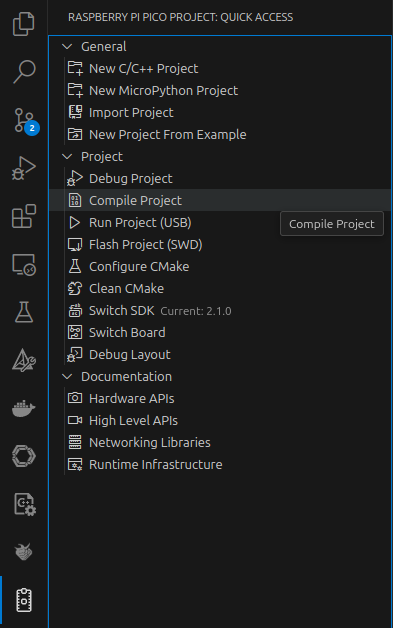

# TOPPERS/FMP3×pico-sdk

[TOPPERS/FMP3](https://github.com/toppers/fmp3_raspberrypi_pico)を[pico-sdk](https://github.com/raspberrypi/pico-sdk)と使えるようにしたプロジェクトの例です。

[Visual Studio Code](https://code.visualstudio.com/)の[Raspberry Pi Pico 拡張機能](https://github.com/raspberrypi/pico-vscode)で作成したプロジェクトに、`fmp3`を追加することで、マルチコア対応 RTOS API が使えます。

pico-sdk でサポートされるボードで使えます。

## リポジトリのクローン

`fmp3`フォルダはサブモジュールとなっているので、下記のコマンドでサブモジュールもクローンしてください。

```bash
git clone https://github.com/exshonda/fmp3_pico_sdk_sample.git
cd fmp3_pico_sdk_sample
git submodule update --init
```

## ビルド方法

Pico 拡張機能のビルド機能をそのまま使用します。



## 新規プロジェクトへの適用方法

Pico 拡張機能で作成したプロジェクトに TOPPERS/FMP3 を追加することが出来ます。その手順を説明します。

[FMP3のリポジトリ](https://github.com/exshonda/fmp3_pico_sdk)を、`git clone`などで適当な場所に配置します。

Pico 拡張機能でプロジェクトを作成し、そのプロジェクトの`CMakeLists.txt`を編集して、TOPPERS/FMP3 を配置したフォルダをビルド対象に含めるようにします。

まず、`fmp3_pico_sdk.cmake`ファイルのインクルードを行うため、下記の行を追加します。

- プロジェクトフォルダ配下に`fmp3`フォルダを配置した場合

    ```cmake
    # TOPPERS/FMP3 の Raspberry Pi Pico SDK 用のコンパイラ定義をインクルード
    include(fmp3/fmp3_pico_sdk.cmake)
    ```

    このリポジトリはこの配置です。

- 別のフォルダに置いた場合

    下記の`path/to/fmp3`を書き換えて、`fmp3`を配置したフォルダの絶対パスか、相対パスで書き換えます。

    ```cmake
    # TOPPERS/FMP3 の Raspberry Pi Pico SDK 用のコンパイラ定義をインクルード
    include(path/to/fmp3/fmp3_pico_sdk.cmake)
    ```

タスクやセマフォなどを静的APIで定義したcfgファイルを指定します。
このリポジトリでは[fmp3_pico_sdk.cfg](fmp3_pico_sdk.cfg)となっていますが、他の名前に変更できます。

```cmake
# TOPPERS/FMP3 のカーネルオブジェクト定義のcfgファイルを設定
set(FMP3_APP_CFG_FILE ${PROJECT_SOURCE_DIR}/fmp3_pico_sdk.cfg)
```

fmp3をサブプロジェクトとして追加します。
上記の`include`で、FMP3へのパスが`FMP3_ROOT_DIR`という変数に設定されるので、以降で使用できます。

```cmake
# TOPPERS/FMP3 のライブラリを追加
add_subdirectory(${FMP3_ROOT_DIR} fmp3)
```

`add_subdirectory`の第２引数は、ビルド時に出力フォルダ名として使用されます。

TOPPERS/FMP3 付属のソースファイルを追加します。このサンプルのcfgファイルでは必要ですが、cfgファイルの内容に応じて編集してください。

```cmake
# TOPPERS/FMP3 付属のソースファイルを追加
include(${FMP3_ROOT_DIR}/library/library.cmake)
include(${FMP3_ROOT_DIR}/syssvc/syssvc.cmake)
```

TOPPERS/FMP3 ライブラリの`fmp3`を追加します。マルチコア用ライブラリの`pico_multicore`も必要なので追加してください。

```cmake
# Add the standard library to the build

target_link_libraries(fmp3_pico_sdk
    pico_stdlib
    pico_multicore
    fmp3
)
```

最後に「`fmp3_set_pico_sdk_options`」関数を呼び出します。引数にはプロジェクト作成時に付けた名前を設定します。
プロジェクト名は`CMAKE_PROJECT_NAME`変数で取得できます。

```cmake
# TOPPERS/FMP3 を使うための Raspberry Pi Pico SDK の設定
fmp3_set_pico_sdk_options(${CMAKE_PROJECT_NAME})
```

TOPPERS/FMP3 で使用する変数が想定通りのメモリ配置になっているかチェックが行えますが、pico-sdk では使用していないシンボルを削除するリンクオプションが付いてているので、チェックは行えないため省略します。

```cmake
# TOPPERS/FMP3 のチェックを行う（シンボルがGCされるとエラーになるので省略）
#fmp3_cfg_check(${CMAKE_PROJECT_NAME})
```
